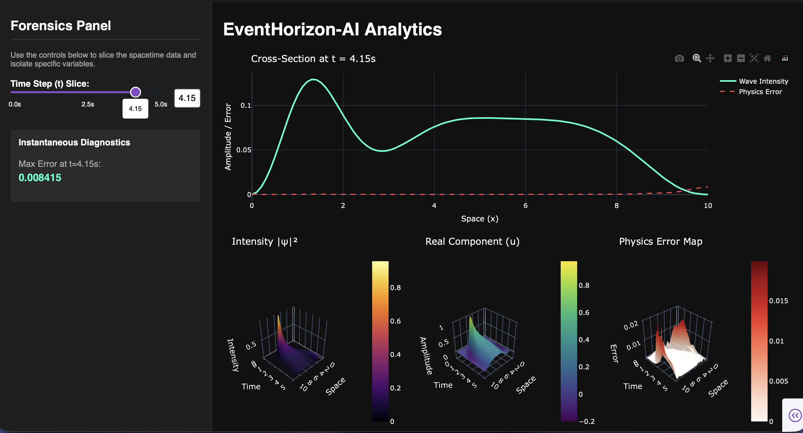

# EventHorizon-AI: Neural Simulation & Analytics
**Simulating Optical Analogues of Hawking Radiation using Physics-Informed Neural Networks (PINNs)**




## Overview
EventHorizon-AI is a physics and machine learning forensics tool designed to simulate and analyze optical analogues of Hawking radiation. Since stellar-mass black hole radiation is virtually undetectable ($T \approx 10^{-8} \text{ K}$), physicists utilize intense laser pulses in optical fibers to create "effective event horizons." 

Instead of relying on traditional numerical solvers, this project utilizes a **Physics-Informed Neural Network (PINN)** to solve the complex Nonlinear Schrödinger Equation (NLSE) governing these pulses. The repository includes an interactive, real-time analytics dashboard built with Plotly Dash to forensically audit the AI's internal physics representations.

## Key Features
* **Physics-Informed Neural Network:** A custom PyTorch architecture trained to minimize the physical residuals of the NLSE without relying on pre-labeled datasets.
* **Mechanistic Interpretability Engine:** Maps the exact gradients and mathematical errors of the neural network across 3D spacetime, allowing researchers to visually pinpoint where the AI violates the laws of physics.
* **Adaptive Importance Sampling:** Implements targeted training loops to overcome the network's spectral bias, dynamically clustering training collocation points around high-curvature spacetime regions to reduce simulation error by >90%.
* **Real-Time Analytics Dashboard:** An interactive web UI featuring 3D surface mapping, temporal slicing, and instantaneous diagnostic metrics.

## The Physics (Nonlinear Schrödinger Equation)
The model learns to propagate the wave function $\psi = u + iv$ by minimizing the residual of the NLSE:

$$i \frac{\partial \psi}{\partial t} + \frac{1}{2} \frac{\partial^2 \psi}{\partial x^2} + |\psi|^2 \psi = 0$$

The network calculates first and second-order spatial and temporal derivatives via PyTorch's `autograd` engine, evaluating the physical integrity of the "event horizon" formation at every frame.

## Project Structure
```text
EventHorizon-AI/
├── data/
│   └── processed/          # Serialized PyTorch model weights (.pth)
├── notebooks/
│   └── 01_physics_baseline.ipynb # Mathematical baseline using Finite Difference Method
├── src/
│   ├── models/
│   │   └── pinn.py         # PyTorch PINN architecture
│   ├── physics/
│   │   └── wave_eq.py      # Autograd derivative functions and NLSE loss constraints
│   ├── dashboard/
│   │   └── app.py          # Plotly Dash web application and UI layout
│   └── train.py            # Adaptive sampling and network training loop
├── requirements.txt
└── README.md
```
## Installation & Usage

### Clone the repository and set up the environment

```bash
git clone [https://github.com/samuelhaskel/EventHorizon-AI.git](https://github.com/samuelhaskel/EventHorizon-AI.git)
cd EventHorizon-AI
python -m venv venv
source venv/bin/activate  # Or .\venv\Scripts\activate on Windows
pip install -r requirements.txt
```

### (Optional) To rerun adaptive importance sampling and generate new model weights
```bash
python src/train.py
```

### Launch the Analytics Dashboard

```bash
python src/dashboard/app.py
```
